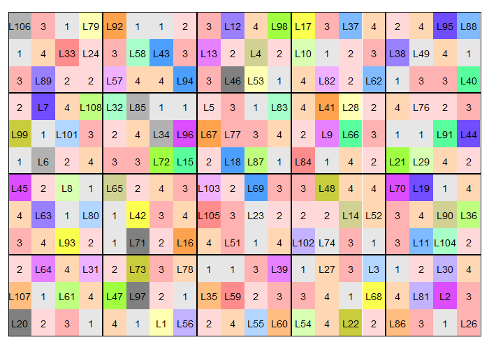

```{r setup, include=FALSE}
knitr::opts_chunk$set(echo = FALSE)
```

## Introduction

<!-- ## Abstract -->

<!-- \footnotesize -->

<!-- Recent advances in phenotyping and statistical techniques have enabled exploration of a large number of trait in a greater depth. Current study undertaken in Agriculture and Forestry University, Rampur, Chitwan highlights use of augmented row-column design for a small number of checks for estimation of genotypes' effect under a mixed modeling framework to uncovering association of wheat crops' yield with the traits characterizing its leaf health (resistance to foliar disease, flag leaf greenness, leaf area under greenness (LAUG) and flag leaf relative chlorophyll content. Even though significant genotypes' effects were found for most traits, few yield component traits along with a number of crop architecture traits -- thousand kernel weight, plant height, flag leaf area, canopy temperature depression, days to heading and days to anthesis -- had significant variation due to blocking or environmental factors. Major leaf health traits that influenced yield were the leaf greenness and relative chlorophyll content. BLUP estimation and adjustment for fixed effects dictate that 68.9\% of the genotypic variation of entry genotypes in yield was explained by the full model (one having both blocking and leaf health components). This reveals that augmenting leaf health traits with structured blocking factors leads to improved yield estimates. Apart from the check variety Aditya, which gave the lowest yield ( $3.02 \pm 0.61$ \si{\tonne\per\hectare}), all other check varieties were similar (3.54 \si{\tonne\per\hectare}, 3.33 \si{\tonne\per\hectare}, 3.42 \si{\tonne\per\hectare}). However, they had more contrasting differences in Number of tillers \si{\per\meter^{2}}. Findings based on block adjusted random effect estimates suggest for inclusion of some entry genotypes, those having leaf traits characterizing good health and with high yielding characters, in advanced evaluation trials. Top ranking high yielding entry genotypes were: TRCH/SRTU//KACHU/3/KINGBIRD\#1, WHEAR/SOKOLL/4/PASTOR// MILAN/KAUZ/3/B $\ldots$ and MUNAL \#1*2/4/HUW234+ LR34/PRINIA//PBW3 $\ldots$ -->

\footnotesize

Post-anthesis foliar health could be a proxy for determining final grain yield. It has a direct implication on grain filling behavior of a plant. Ideally, the contribution of pre-anthesis photosynthetic reserves to the final grain yield has been found to stall around 5\% to 10\% [@sharma1992duration]. A major fraction of total yield, therefore, is dependent upon the photosynthesis that occurs post-anthesis. Terminal leaves, particularly the flag leaf and the one directly below it, have significant contribution to genotypic variation in yield [@aslam1978photosynthesis] with respect to provisioning of assimilate to functionally active parts of plants including the storage organ(grain). Similarly, it is well known that various biotic agents, primarily diseases, sustain reduction in yield with pathways that relate to the effective photosynthetic surface area [@lopes2012stay].

Current study aims to make use of "augmented row-column design for a small number of checks" for estimation of genotypes' effect under a mixed modeling framework to uncovering association of wheat crops' yield with the traits characterizing its leaf health.

## Materials and methods

\footnotesize

Test material consisted of 104 diverse lines representing advanced genotypes screened for resistance to various diseases. Four check varieties – Aditya, Bhrikuti, Gautam and Tilottama -- released by NARC and adapted to a wide range of environmental conditions of Nepal were included alongside. Observations were kept for final yield and associated as well as morpho-phenological traits, that were potentially prolonging the leaf health during post-anthesis period.

Field was sown in Nov 24, 2016. Seeds were continuously sown within a row while maintaining standard 25 cm row-row distance. Field was divided into rectangular grid to assign genotypes into rows, columns, rowgroups and columngroup. Each plot occupied 1 \si{\meter^2} in the grid.
<!-- The irrigation was scheduled to best avoid pre-antheis moisture stress, as this has been implied in largest losses resulting in number of fertile florets and the final grain weight [@innes1981effect].  -->
Standard interculture operations were followed with none pesticidal sprays.

##

At least four plant hills per plot were sampled for observations except when visually scoring, in which case more than 50% canopy coverage was examined. Features like soil temperature and soil moisture formed basis for environmental covariate adjustment.

Observational traits were categorized into three underlying features: 
\begin{enumerate}
  \item Leaf health was defined as complex state characterized by resistance to foliar disease, flag leaf greenness, leaf area under greenness (LAUG) and flag leaf relative chlorophyll content. 
  \item Yield and yield components traits comprise number of grains panicle, number of effective tillers, thousand kernel weight, and
  \item Morpho-phenology were described by features like plant height, flag leaf area, canopy temperature depression, days to heading and days to anthesis.
\end{enumerate}

<!-- ## -->

<!-- \footnotesize -->

<!-- A mixed linear model was fitted for each of the response variables $y$ using lme4 package [@bates2014fitting]. All model terms except for the check variety effects, which was considered as fixed because they are purposely selected, were expressed with random intercept terms for obtaining model parameters [@wolfinger1997recovering]. REML estimate of the parameters were obtained by a single call for both fixed and random effects terms. A general matrix structure representation in a linear mixed model with conditional distribution of $y$ given $\mathcal{B} =\beta$ can be represented as shown in Equation \eqref{eq:linear-mixed-form}, -->

\begin{equation}
(y|\mathcal{B}) \approx \mathcal{N}(X\beta + Zb, \sigma^{2}W^{-1})
\label{eq:linear-mixed-form}
\end{equation}

<!-- where $Z$ is the $n \times q$ model matrix for the $q$-dimensional vector-valued random effects variable, $\mathcal{B}$, whose value we are fixing at $b$. The unconditional distribution of $\mathcal{B}$ is also multivariate normal with mean zero and a parameterized $q \times q$ variance-covariance matrix [@bates2014fitting]. For multiple comparison of fixed effects means and stepwise variable selection procedure, least squares means and confidence intervals were calculated by Satterthwaite approximation of degrees of freedom [@alexandra2017]. -->

##

```{r design-canopy, fig.ncol = 2, fig.width=4, out.width=c("50%", "30%"), fig.cap="Study design and crop canopy shown during recording of observation", fig.subcap=c("Randomized layout of the row-column experimental design", "Wheat crop plot at Jan 9, 2017 (46 days after sowing")}


```

## Results

<!-- Mixed model summary of fixed effects terms of yield and yield component traits -->

<!-- \begingroup -->
<!-- \tiny -->
<!-- \begin{longtable}{@{\extracolsep{1pt}}lccccc} -->
<!-- \\[-1.8ex]\hline -->
<!-- \hline \\[-1.8ex] -->
<!--  & \multicolumn{5}{c}{\textit{Dependent variable:}} \\ -->
<!-- \cline{2-6} -->
<!-- \\[-1.8ex] & \multicolumn{5}{c}{\textit{linear}} \\ -->
<!--  & \multicolumn{5}{c}{\textit{mixed-effects}} \\ -->
<!--  & Yield & \parbox[t]{2.5cm}{Number of effective tillers} & \parbox[t]{2.5cm}{Thousand kernel weight} & \parbox[t]{2.5cm}{Grains per panicle} & Panicle length \\ -->
<!-- \\[-1.8ex] & (1) & (2) & (3) & (4) & (5)\\ -->
<!-- \hline \\[-1.8ex] -->
<!--  Bhrikuti & 0.52$^{***}$ (0.14) & 3.34$^{**}$ (1.35) & 1.17 (0.85) & $-$0.22 (0.49) & 0.51 (0.33) \\ -->
<!--   & p = 0.0003 & p = 0.02 & p = 0.17 & p = 0.66 & p = 0.13 \\ -->
<!--   Gautam & 0.31$^{**}$ (0.14) & 0.33 (1.36) & 2.06$^{**}$ (0.85) & 1.33$^{***}$ (0.49) & 1.22$^{***}$ (0.33) \\ -->
<!--   & p = 0.03 & p = 0.81 & p = 0.02 & p = 0.01 & p = 0.0003 \\ -->
<!--   Tilottama & 0.40$^{***}$ (0.14) & 6.94$^{***}$ (1.36) & $-$0.32 (0.85) & 0.38 (0.49) & 0.27 (0.33) \\ -->
<!--   & p = 0.005 & p = 0.0000 & p = 0.72 & p = 0.45 & p = 0.43 \\ -->
<!--   Aditaya (Constant) & 3.02$^{***}$ (0.61) & 26.80$^{***}$ (2.45) & 36.40$^{***}$ (4.32) & 27.00$^{***}$ (1.88) & 16.30$^{***}$ (1.09) \\ -->
<!--   & p = 0.0000 & p = 0.00 & p = 0.00 & p = 0.00 & p = 0.00 \\ -->
<!--  \hline \\[-1.8ex] -->
<!-- Observations & 202 & 238 & 201 & 202 & 226 \\ -->
<!-- Log Likelihood & $-$209.00 & $-$752.00 & $-$575.00 & $-$452.00 & $-$414.00 \\ -->
<!-- Akaike Inf. Crit. & 443.00 & 1,528.00 & 1,174.00 & 928.00 & 853.00 \\ -->
<!-- Bayesian Inf. Crit. & 482.00 & 1,570.00 & 1,213.00 & 968.00 & 894.00 \\ -->
<!-- \hline -->
<!-- \hline \\[-1.8ex] -->
<!-- \textit{Note:}  & \multicolumn{5}{r}{$^{*}$p$<$0.1; $^{**}$p$<$0.05; $^{***}$p$<$0.01} \\ -->
<!-- \end{longtable} -->
<!-- \endgroup -->

<!-- ## -->

The model with both genotypes (checks and entries) outperformed in comparison to the one without in predicting the real yield (\(\chi^2 = 14.4\) with \(df = 4\)).

Pairwise comparison of fixed effects estimate indicate that check variety Aditya has the lowest yield amongst all varieties while other have similar yields. Average yield of the lowest yielder is \(3.02\ tons\ ha^{-1}\ (\pm\ 0.60)\) and Bhrikuti yields the highest with average yield of \(3.54\ tons\ ha^{-1}\ (\pm\ 0.60)\). 

Genotypes show highly significant differences for the disease resistance trait. LRT shows that both checks and entries possess significant heritable variation. Check variety Gautam is relatively asymptomatic (\(2.51\ (\pm\ 1.30)\)) than Bhrikuti(\(3.32\ (\pm\ 1.30)\)) and Tilottama (\(3.35\ (\pm\ 1.30)\)) to foliar pathogen. Although, no distinction could be made on the severity scale of the disease (All check varieties exhibited similarly less affected (2.5-5.0) symptom at the time of scoring). Entry genotypes also show considerable amount of heritable variation.

##

Genotypes showed highly significant differences in the greenness score measured measured at Zadok's stages 75 and 85. LRT shows that both checks and entries possess significant heritable variation. Pairwise comparison of fixed effect estimates for both growth stages implicate check variety Aditya for retaining maximum greenness of the flag leaf followed by Bhrikuti and Gautam (both have similar greenness scores) and Tilottama. Noteworthy variation was also found among the entry genotypes (significant at \(p < 0.01\)). Check variety Aditya suffered largest reduction in greenness (\(93.03\ (\pm\ 19.70)\)), while Tilottama had the least (\(77.35\ (\pm\ 19.71)\)) loss of all check varieties. 

Highly significant difference exist among the genotypes for Plant height trait. However, the random effects estimates of plant height showed no difference among entry genotypes. No significant difference was discovered among the genotypes for flag leaf surface area trait, either. In contrast, entry genotypes' chlorophyll content at Zadok's stage 65 showed considerable variation, while the it is not true for check genotypes.

##

\footnotesize

Significant differences were detected among the check genotypes but not among entries for the SPAD measured at Zadok's stage 85. Likewise, genotypes have significant differences for the Canopy temperature depression (CTD) measured near anthesis stage. Fixed effect estimates shows that canopy structure of check variety Bhrikuti favors greater reduction in temperature than check variety Aditya (\(9.08^\circ C\ (\pm\ 0.79)\)). Other varieties were at par with both of the check varieties. Highly significant difference were detected among the genotypes were found for days to heading trait. All check varieties differ from one another except for Aditya (late heading type) (with mean of \(67.79\ (\pm\ 2.40)\) days) and Gautam, which require similar days for heading. Mean number of days taken for head to develop in half of the population was lowest in Tilottama (\(62.71\ (\pm\ 2.40)\) days) variety. Similarly, entry genotype levels also exhibited high variation for the trait.

\begin{figure}[H]

{\centering \includegraphics[width=0.40\linewidth]{cor-graph-barplot-viz-checks-1} 

}
\caption{Number of checks at different growth stages on February 2, 2017. Time point comparison of different stages of reproductive periods of growth reaffirms that Tilottama variety flowers the earliest amongst the check varieties and Aditya reaches to the flowering relatively late.}\label{fig:cor-graph-barplot-viz-checks}
\end{figure}


##

\footnotesize

\begin{figure}[H]
\footnotesize
{\centering 
\subfloat[\tiny Yield\label{fig:yield-blup-viz-1}]{\includegraphics[width=.25\linewidth]{yield-blup-viz-1} }
\subfloat[\tiny Number of effective tillers\label{fig:yield-blup-viz-2}]{\includegraphics[width=.25\linewidth]{yield-blup-viz-2} }
\subfloat[\tiny Thousand kernel weight\label{fig:yield-blup-viz-3}]{\includegraphics[width=.25\linewidth]{yield-blup-viz-3} }\newline
\subfloat[\tiny Number of grains per panicle\label{fig:yield-blup-viz-4}]{\includegraphics[width=.25\linewidth]{yield-blup-viz-4} }
\subfloat[\tiny Panicle length\label{fig:yield-blup-viz-5}]{\includegraphics[width=.25\linewidth]{yield-blup-viz-5} }}
\caption{\centering Scatterplot of observed versus BLUP values of yield and yield component traits}\label{fig:yield-blup-viz}
\end{figure}

The coefficient of determination, between the observed and fitted values of random effects model are 0.61, 0.36, 0.71, 0.55, 0.48, respectively for the Yield, Number of effective tillers, Thousand kernel weight, Number of grains per panicle and Panicle length.

## Conclusion

Major leaf health traits that influenced yield were the leaf greenness and relative chlorophyll content. BLUP estimation and adjustment for fixed effects dictate that 68.9\% of the genotypic variation of entry genotypes in yield was explained by the full model (one having both blocking and leaf health components). This reveals that augmenting leaf health traits with structured blocking factors leads to improved yield estimates. Apart from the check variety Aditya, which gave the lowest yield ( $3.02 \pm 0.61$ \si{\tonne\per\hectare}), all other check varieties were similar (3.54 \si{\tonne\per\hectare}, 3.33 \si{\tonne\per\hectare}, 3.42 \si{\tonne\per\hectare}). However, they had more contrasting differences in Number of tillers \si{\per\meter^{2}}. Findings based on block adjusted random effect estimates suggest for inclusion of some entry genotypes, those having leaf traits characterizing good health and with high yielding characters, in advanced evaluation trials. Top ranking high yielding entry genotypes were: TRCH/SRTU//KACHU/3/KINGBIRD\#1, WHEAR/SOKOLL/4/PASTOR// MILAN/KAUZ/3/B $\ldots$ and MUNAL \#1*2/4/HUW234+ LR34/PRINIA//PBW3 $\ldots$

## References
\tiny